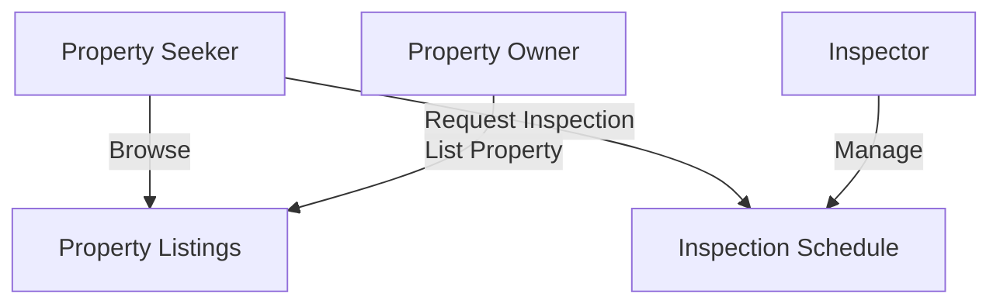

# User Stories Visualization

The following diagram illustrates key user stories and their interactions within the property inspection application.

The diagram can be rendered using a Mermaid-compatible viewer.

