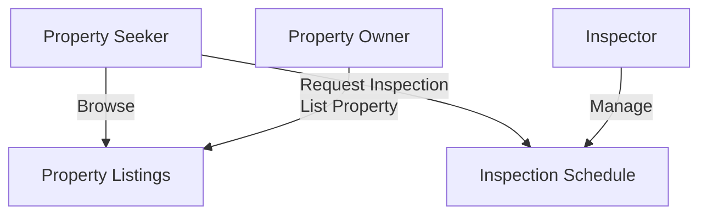

To render the diagram with Mermaid:

1. **Online Editors:**  
    - Copy the Mermaid code block and paste it into an online Mermaid live editor, such as [Mermaid Live Editor](https://mermaid.live/).
2. **Markdown Viewers:**  
    - Use a markdown viewer or editor that supports Mermaid diagrams (e.g., VS Code with the "Markdown Preview Mermaid Support" extension).
3. **Static Site Generators:**  
    - If using a static site generator (like MkDocs or Docusaurus), ensure the Mermaid plugin is enabled.

**Example:**  
Paste the following code block into your Mermaid-compatible tool to visualize the diagram:

