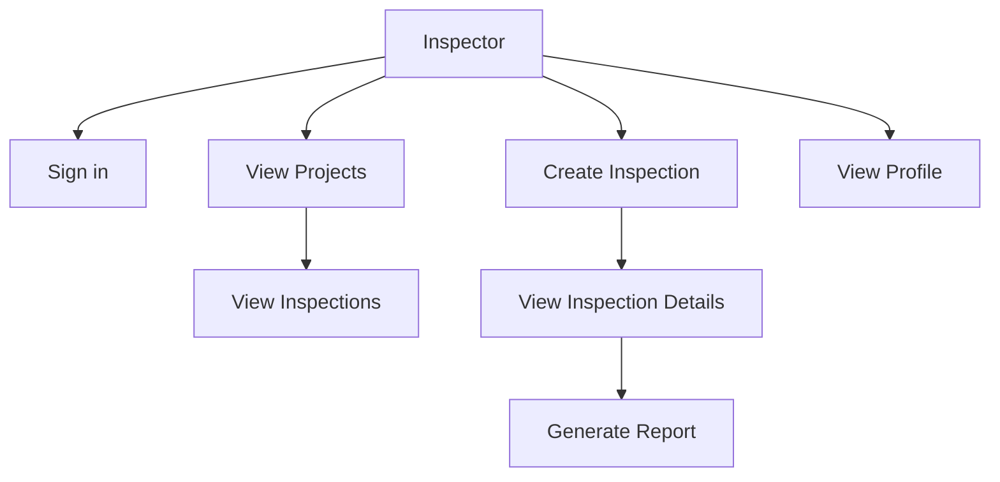

# User Stories Diagram

The following diagram visualizes the key user stories for the Property Inspection App.

**User Stories**

- As an inspector, I can sign in using Microsoft so that I can access the app.
- As an inspector, I can view a list of projects to choose where to perform inspections.
- As an inspector, I can view inspections within a project to review past work.
- As an inspector, I can create a new inspection to document property conditions.
- As an inspector, I can view inspection details to review collected data.
- As an inspector, I can generate a report from an inspection to share findings.
- As an inspector, I can view and update my profile to keep my information current.
